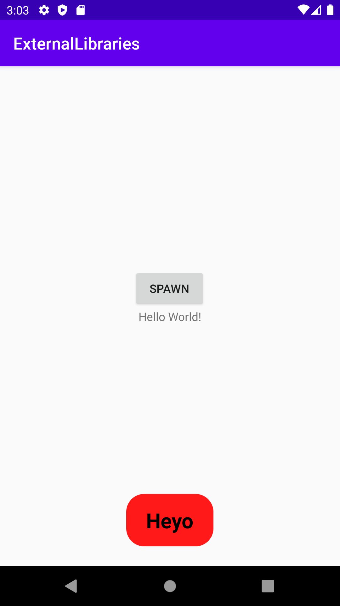

# Report


```
function errorCallback(error) {
<style name="CustomRedToast">
    <item name="stTextBold">true</item>
    <item name="stTextSize">25sp</item>
    <item name="stColorBackground">#FF0000</item>
    <item name="stTextColor">#000000</item>
</style>
}
```

